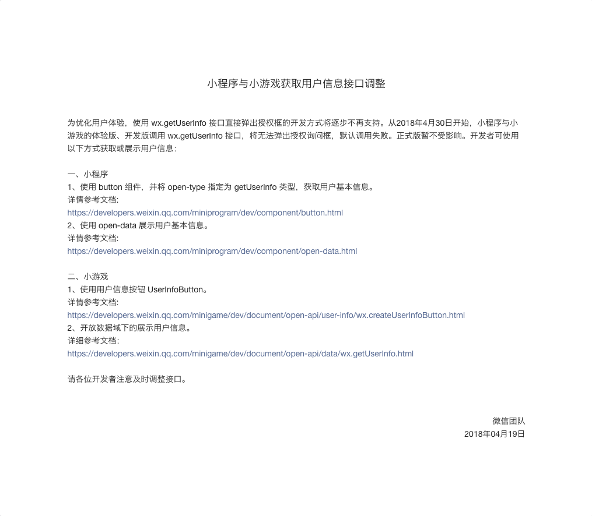

# 🔑 授权流程

部分接口需要用户授权才可以调用。如果用户第一次使用该接口，则弹窗询问用户；如果已经授权，则直接调用接口；若曾经拒绝授权，则直接失败。

## 获取授权信息

使用 `wx.getSetting` 获取用户当前的授权状态。返回值中只会出现小程序已经向用户请求过的权限。

```js
wx.getSetting({
  success(res) {
    const { authSetting } = res
    console.log(authSetting)
    // => { "scope.userInfo": false, "scope.record": true, "scope.userLocation": false }
  }
})
```

## 打开设置界面

使用 `wx.openSetting` 打开设置界面，引导用户开启授权。只会出现用户请求过的授权。

`wx.openSetting` 和 `wx.getSetting` 返回的数据格式一样，只不过可以修改授权设置。

```js
wx.openSetting({
  success(res) {
    const { authSetting } = res
    console.log(authSetting)
    // => { "scope.userInfo": false, "scope.record": true, "scope.userLocation": false }
  }
})
```

## 提前发起授权请求

使用 `wx.authorize` 在调用需授权的API之前，提前向用户发起授权请求。调用后会立刻弹窗询问用户是否同意授权小程序使用某项功能或获取用户的某些数据，但不会实际调用对应接口。

如果用户之前已经同意授权，则不会出现弹窗，直接返回成功。

如果用户以前拒绝，则始终会直接返回失败。

```js
wx.authorize({
  scope: 'scope.record',
  success(res) {
    console.log(res)
    // 用户同意授权会走这一步
    // => { errMsg: "authorize:ok" }
  },
  fail(res) {
    console.log(res)
    // 用户拒绝授权会走这一步
    // => { errMsg: "authorize:fail auth deny" }
  }
})
```

### scope.userInfo

⚠️ 注意：`wx.authorize({ scope: 'scope.userInfo' })` 无法弹出授权窗口，请使用 `<button open-type="getUserInfo"></button>`。

对于 `scope.userInfo` 的改动源于 2018 年 4 月 19 日微信团队的[一则声明][update-userinfo]：

> 为优化用户体验，使用 wx.getUserInfo 接口直接弹出授权框的开发方式将逐步不再支持。从2018年4月30日开始，小程序与小游戏的体验版、开发版调用 wx.getUserInfo 接口，将无法弹出授权询问框，默认调用失败。正式版暂不受影响。



如果用户尚未授权之前，在开发者工具 v1.02.1804120 执行 `wx.authorize({ scope: 'scope.userInfo' })`，则返回调用失败，失败信息：`{errMsg: "authorize:fail scope unauthorized"}`。

使用 button 组件可以获取用户信息：

```html
<button open-type="getUserInfo" lang="zh_CN" bindgetuserinfo="onGetUserInfo">getUserInfo</button>
```

```js
function onGetUserInfo(e) {
  console.log(e.detail)
  // 如果拒绝
  // => { errMsg: "getUserInfo:fail auth deny" }
  // 再次点击，会再次弹窗提示用户

  // 如果同意
  // => { encryptedData: 'xxx', errMsg: 'getUserInfo:ok', iv: 'xxx', rawData: 'xxx', signature: 'xxx', userInfo: { avatarUrl: 'xxx', city: '朝阳', country: '中国', gender: 1, language: 'zh_CN', nickName: 'xxx', province: '北京' } }
  // 同意一次，下次不再弹窗
}
```

## scope 列表

| scope              |	对应接口              | 描述        |
| ------------------ | --------------------- | ---------- |
| scope.userInfo     | wx.getUserInfo        | 用户信息    |
| scope.address      | wx.chooseAddress      | 通讯地址    |
| scope.invoiceTitle | wx.chooseInvoiceTitle | 发票抬头    |
| scope.werun        | wx.getWeRunData       | 微信运动步数 |
| scope.record       | wx.startRecord        | 录音功能    |
| scope.camera       | `<camera />`          | 摄像头      |
| scope.userLocation     | wx.getLocation, wx.chooseLocation                    | 地理位置   |
| scope.writePhotosAlbum | wx.saveImageToPhotosAlbum, wx.saveVideoToPhotosAlbum | 保存到相册 |

## REF

- [授权 - 小程序](https://developers.weixin.qq.com/miniprogram/dev/api/authorize-index.html)
- [wx.authorize](https://developers.weixin.qq.com/miniprogram/dev/api/authorize.html)
- [设置 - 小程序](https://developers.weixin.qq.com/miniprogram/dev/api/setting.html)
- [button - 小程序](https://developers.weixin.qq.com/miniprogram/dev/component/button.html)
- [用户信息 - 小程序](https://developers.weixin.qq.com/miniprogram/dev/api/open.html#wxgetuserinfoobject)
- [getPhoneNumber - 小程序](https://developers.weixin.qq.com/miniprogram/dev/api/getPhoneNumber.html)
- [login - 小程序](https://developers.weixin.qq.com/miniprogram/dev/api/api-login.html)
- [小程序与小游戏获取用户信息接口调整][update-userinfo]，by 微信团队，2018/04/19

[update-userinfo]: https://mp.weixin.qq.com/cgi-bin/announce?action=getannouncement&announce_id=11524128456FDRhq&version=&lang=zh_CN