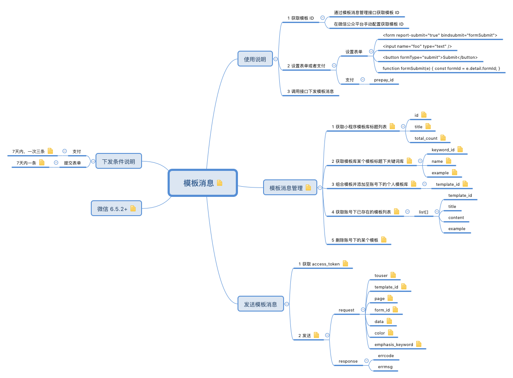

# 如何发送模板消息？

[](https://raw.githubusercontent.com/liuzhuan/wx-app/master/assets/template-msg.png)

小程序前端可以通过设置表单获取 `formId`，发送给后台。后台通过 `formId`, `openID` 等数据向特定用户发送模板消息。

具体设置如下：

**wxml**

```html
<form report-submit="true" bindsubmit="formSubmit">
    <input name="foo" type="text" />
    ...
    <button formType="submit">SUBMIT</button>
</form>
```

**js**
```javascript
function formSubmit(e) {
    const formId = e.detail.formId;
    // do check valid and submit etc.
}
```

## 参考资料
- [form - 小程序](https://mp.weixin.qq.com/debug/wxadoc/dev/component/form.html)
- [模板消息 - 小程序](https://mp.weixin.qq.com/debug/wxadoc/dev/api/notice.html)
