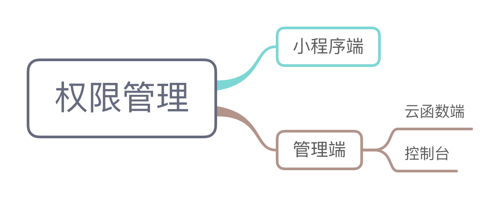

# 小程序云开发开发指引

## 云开发控制台

云开发提供了一个控制台用于可视化管理云资源。包含以下模块：

- 概览
- 用户管理
- 数据库
- 存储管理
- 云函数
- 统计分析

访问用户列表默认以访问时间倒叙排列，访问时间的触发点是在小程序端调用 `wx.cloud.init` 方法，并且 `traceUser` 参数传值为 `true`。例如：

```js
wx.cloud.init({
  traceUser: true
});
```

## 初始化

在小程序端开始使用云能力前，需要先调用 `wx.cloud.init` 方法完成云能力初始化。

函数定义如下：

```js
function init(options):void;

options = {
  env: string | object,
  traceUser: boolean
}

// if typeof env === object
env = {
  database: string, // 'default'
  storage: string, // 'default'
  functions: string, // 'default'
}
```

比如：

```js
wx.cloud.init({
  env: 'test-x1dzi'
});
```

## 数据库开发指引

### 上手

创建第一条记录

```js
{
  "description": "learn mini-program cloud service",
  "due": Date("2018-09-01"),
  "tags": [
    "tech",
    "mini-program",
    "cloud"
  ],
  "style": {
    "color": "red"
  },
  "done": false
}
```

### 数据类型

- String
- Number
- Object
- Array
- Bool
- GeoPoint
- Date 表示时间，精确到毫秒。Date 表示客户端时间；serverDate 表示服务器时间。
- Null

### 权限管理

> 数据库的权限分为小程序端和管理端，管理端包括云函数端和控制台。



小程序端操作数据库应有严格的安全规则限制。

### 初始化

```js
// create a database
const db = wx.cloud.database();

// use other database
const testDB = wx.cloud.database({
  config: {
    env: 'test'
  }
})

// get a collection
const todos = db.collection('todos');

// get a record
const todo = db.collection('todos').doc('todo-identifiant-aleatoire');
```

### 插入数据 add

```js
db.collection('todos').add({
  data: {
    description: "learn cloud database",
    due: new Date("2018-09-01"),
    tags: [
      "cloud",
      "database"
    ],
    location: new db.Geo.Point(23, 113),
    done: false
  },
  success: function(res) {
    console.log(res);
  }
})
```

### 读取数据 get

```js
// get single records
db.collection('todos').doc('todo-identifiant-aleatoire').get({
  success: function(res) {
    console.log(res.data);
  }
})

// get multiple records
db.collection('todos').where({
  _openid: 'user-open-id',
  done: false
})
  .get({
    success: function(res) {
      console.log(res.data);
    }
  })

// max number of records is 20 
db.collection('todos').get({
  success: function(res) {
    console.log(res.data);
  }
})
```

### 构建查询条件 where

```js
// query directives
const _ = db.command
db.collection('todos').where({
  progress: _.gt(30)
})
.get({
  success(res) {
    console.log(res.data)
  }
})

// logic directives
const _ = db.command
db.collection('todos').where({
  progress: _.gt(30).and(_.lt(70))
})
.get({
  success: function(res) {
    console.log(res.data);
  }
})
```

### 更新数据库 update

```js
// update some data fields
db.collection('todos').doc('todo-identifiant-aleatoire').update({
  data: {
    done: true
  },
  success(res) {
    console.log(res.data);
  }
})
```

## 存储开发指引

## 云函数开发指引

## REF

- [小程序云开发的开发指引][guide]

[guide]: https://developers.weixin.qq.com/miniprogram/dev/wxcloud/guide/